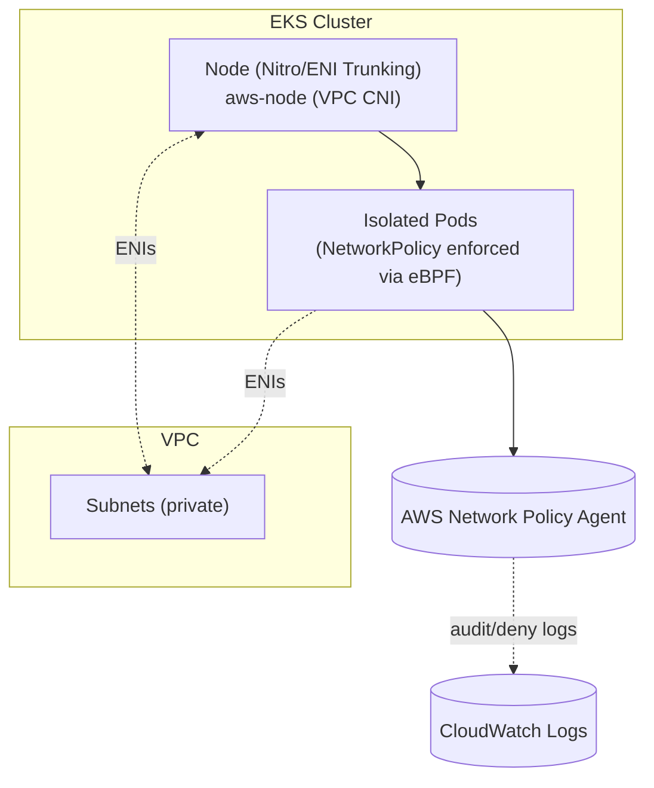

## Problem

By default, EKS pods on the same node can communicate freely. To enforce network isolation for multi-tenant or sensitive workloads, enable the AWS VPC CNI network policy feature, which deploys the AWS Network Policy Agent.

This guide shows how to:
- Enable the AWS VPC CNI network policy feature
- Deploy a network policy controller (AWS Network Policy Agent)
- Debug denied traffic with CloudWatch Logs Insights

## Architecture (high level)





## Prerequisites

- EKS cluster with the AWS VPC CNI managed add-on version 1.14+ (includes AWS Network Policy Agent)
- IAM role `AmazonEKSPodIdentityAmazonVPCCNIRole` (auto-created by AWS or manually provisioned)
- AWS Network Policy Agent (enabled via add-on `configuration_values`)

## 1) Install/Configure AWS VPC CNI Add-on (Terraform)

Enable the AWS VPC CNI add-on with network policy support using the configuration below. This activates the AWS Network Policy Agent, which enforces Kubernetes NetworkPolicy resources using eBPF on the nodes.

```hcl
resource "aws_eks_addon" "vpc_cni" {
  cluster_name = aws_eks_cluster.{cluster_name}.name
  addon_name   = "vpc-cni"

  pod_identity_association {
    role_arn        = "arn:aws:iam::{aws_account_id}:role/AmazonEKSPodIdentityAmazonVPCCNIRole"
    service_account = "aws-node"
  }

  configuration_values = jsonencode({
    "enableNetworkPolicy": "true",
    "nodeAgent": {
      "enablePolicyEventLogs": "true",
      "enableCloudWatchLogs": "true"
    }
  })
}
```

**Configuration explanation:**

- **`enableNetworkPolicy: true`**: Enables the AWS Network Policy Agent controller. This agent watches for Kubernetes NetworkPolicy resources and enforces them at the node using eBPF.
- **`enablePolicyEventLogs: true`**: Logs all policy decisions (ALLOW/DENY) from the agent to help troubleshoot denied traffic.
- **`enableCloudWatchLogs: true`**: Sends policy event logs to CloudWatch Logs under `/aws/eks/{cluster_name}/cluster` for centralized viewing.
- **`pod_identity_association`**: Uses EKS Pod Identity to grant the aws-node DaemonSet permissions to manage VPC CNI resources (replaces the older IRSA approach).

> **Note:** Strict mode is **not** enabled in the above configuration. To enforce fail-closed behavior (pods remain Pending until policies are programmed), follow the AWS documentation to enable strict mode in the VPC CNI network policy settings: [AWS VPC CNI network policy configuration](https://docs.aws.amazon.com/eks/latest/userguide/cni-network-policy-configure.html#cni-network-policy-configure-policy)

> **Note:** This setup assumes you've already created the IAM role `AmazonEKSPodIdentityAmazonVPCCNIRole` or are letting EKS auto-create it during addon attachment.

## 2) Enable Control Plane Logging to CloudWatch (Terraform)

Enable audit logs to track API events and policy decisions:

```hcl
resource "aws_eks_cluster" "this" {
  name     = var.cluster_name
  role_arn = aws_iam_role.eks_cluster.arn

  vpc_config {
    subnet_ids = var.subnet_ids
  }

  # Control plane logs to CloudWatch
  enabled_cluster_log_types = [
    "audit",
  ]
}
```

Audit logs record NetworkPolicy resource creation/updates and help troubleshoot denied traffic.

## 3) Deploy NetworkPolicy Resources

Once the add-on is configured, define NetworkPolicy resources to control traffic. The AWS Network Policy Agent enforces these policies at the node using eBPF.

**Step 1: Create a default deny policy (zero-trust baseline)**

```yaml
apiVersion: networking.k8s.io/v1
kind: NetworkPolicy
metadata:
  name: deny-all-ingress
  namespace: default
spec:
  podSelector: {}
  policyTypes:
    - Ingress
  ingress: []
```

**Step 2: Allow specific traffic (e.g., frontend → backend)**

```yaml
apiVersion: networking.k8s.io/v1
kind: NetworkPolicy
metadata:
  name: allow-backend-from-frontend
  namespace: default
spec:
  podSelector:
    matchLabels:
      app: backend
  policyTypes:
    - Ingress
  ingress:
    - from:
        - podSelector:
            matchLabels:
              app: frontend
      ports:
        - protocol: TCP
          port: 8080
```

### How It Works: NetworkPolicy Enforcement

When you deploy a NetworkPolicy:

1. **Kubernetes applies** the NetworkPolicy resource to the cluster
2. **aws-network-policy-agent** watches for NetworkPolicy changes
3. **Agent programs** eBPF allow/deny rules for matching pods on the node
4. **Node enforces** the rules at the kernel level (efficient, per‑pod)

This provides **real network isolation** (not just a kube-proxy rule, but kernel‑level enforcement on the node).

## 4) Troubleshooting

**Traffic denied unexpectedly:**
- Use CloudWatch Logs Insights queries (see below) to find DENY events.
- Verify the NetworkPolicy selectors match your pod labels.
- Check any security groups or NACLs that might still block traffic outside of NetworkPolicy.

## 5) Monitoring: Prometheus Alert for Packet Drops (Optional)

If you run Prometheus Operator, create a PodMonitor to scrape aws-node metrics:

```yaml
apiVersion: monitoring.coreos.com/v1
kind: PodMonitor
metadata:
  name: aws-node
  namespace: monitoring
  labels:
    release: prometheus-operator
spec:
  namespaceSelector:
    matchNames:
    - kube-system
  podMetricsEndpoints:
  - path: /metrics
    port: agentmetrics
  selector:
    matchLabels:
      app.kubernetes.io/instance: aws-vpc-cni
```

Once metrics are scraped, you can create alerts on packet drop spikes from the network policy agent:

```yaml
- alert: AWSNetworkPolicyAgentPacketDropSurge
  expr: sum(rate(network_policy_drop_count_total[1m])) > 0
  for: 5m
  labels:
    severity: warning
    group: slack
  annotations:
    summary: AWS Network Policy Agent packet drop surge
    description: |
      AWS Network Policy Agent is dropping packets.
      See CloudWatch Logs for details:
      fields @timestamp, @message
      | filter @logStream like /aws-network-policy-agent-audit/
      | filter @message like /DENY/
      | sort @timestamp desc
```

This alert fires if the drop rate exceeds 0 packets/sec over 5 minutes. Adjust the threshold based on your tolerance for denied traffic.

## Key Takeaways

- The AWS Network Policy Agent enforces NetworkPolicy at the kernel level (eBPF) for real isolation.
- Strict mode ensures pods only run when their network isolation is verified (fail‑closed).
- NetworkPolicy resources define ingress/egress rules; audit logs and DENY queries provide visibility.

## References

- [AWS VPC CNI Network Policy configuration](https://docs.aws.amazon.com/eks/latest/userguide/cni-network-policy-configure.html#cni-network-policy-configure-policy)
- [AWS VPC CNI Network Policy & Troubleshooting](https://repost.aws/articles/ARFP1toB5RTrGHQCDQJPFxyw/aws-vpc-cni-network-policy-architecture-and-troubleshooting)
- [EKS network policy troubleshooting](https://docs.aws.amazon.com/eks/latest/userguide/network-policies-troubleshooting.html)
- [AWS Network Policy Agent](https://github.com/aws/aws-network-policy-agent)
- [Kubernetes NetworkPolicy](https://kubernetes.io/docs/concepts/services-networking/network-policies/)

## CloudWatch Logs Insights: Handy Queries

Run these against control plane logs under `/aws/eks/<cluster>/cluster`.

### Network policy agent: denied traffic

Debug network policy denials logged by the aws-network-policy-agent:

```
fields @timestamp, @message
| filter @logStream like /aws-network-policy-agent-audit/
| filter @message like /DENY/
| sort @timestamp desc
```
